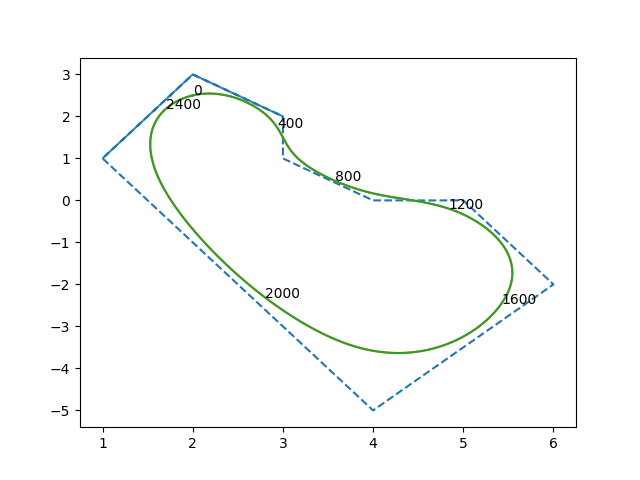
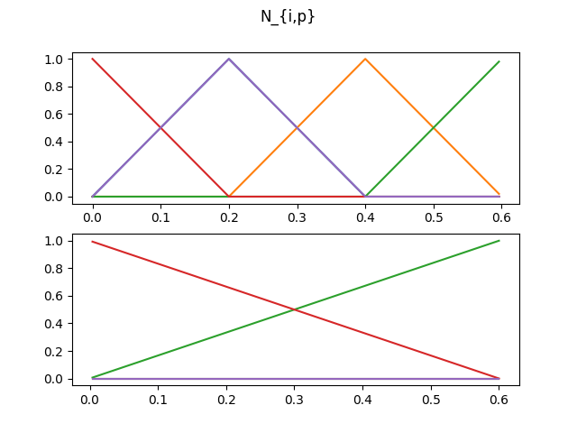
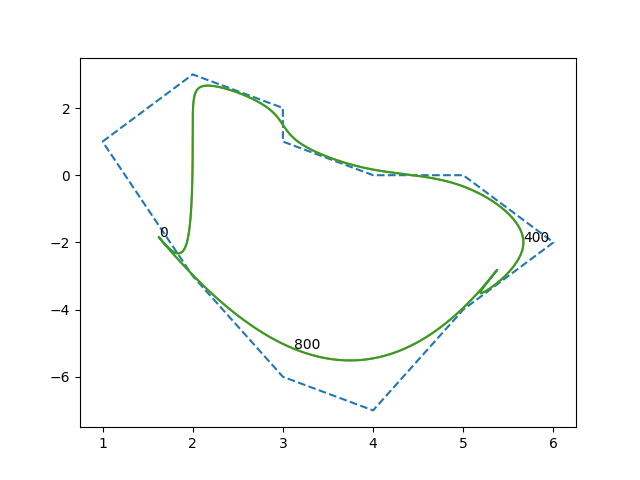

## closed B-spline curve


Referencd from [link](https://pages.mtu.edu/~shene/COURSES/cs3621/NOTES/spline/B-spline/bspline-curve-closed.html), it seems
two methods can be used to creat closed b-spline curve which are Wrapping Control Points and Wrapping Knots. But this lecture doesn' t 
explain specific algortihm in detail, which may be still hard for people to understand and put it into action.

Therefore, I provide my algorithm by using these two methods. Both of them will use the same B-spline curve synthesis function:


$$ C(u) = \sum_{i=0}^n N_{i,p}(u)P_i $$

The attribute m = n+p+1 is also valid in both circumstance. The differences between them are in how to get $N_{i,p}$
###  Wrapping Control Points
    
This method design an uniform knot sequence of m+1 knots, the domain of curve is [$u_p$, $u_{n-p}$]. The corresponding
code in basis_array.py is shown as followed:

```buildoutcfg
# method1: line35,36
_t = 1.0 / m  # t between clamped ends will be evenly spaced (not a necessary condition, however)
t = [t_ * _t for t_ in range(m + 1)]
# method2: line38,39
_t = 1.0 / (m - k * 2)  # t between clamped ends will be evenly spaced (not a necessary condition, however)
t = [t_*_t for t_ in range(-k, 0, 1)] + [t_ * _t for t_ in range(m - (k * 2) + 1)] + [1+t_*_t for t_ in range(1, k+1)]

# line43
t_ = np.arange(t[3], t[-4], .0004)

```

both methods can work but method2 guarantee that valid domain is in [0,1]

In closed_curve.py, we wrap p control points in function wrapping_controlps("basis_data1_2500/basis_array_") (line 8,9). After
running it, we get image as followed:




Because we already set the domain of u in basis_array.py(line43), we don' t need to constraint it in output area. But if we 
don't set it in basis_array, we can require the output area as line34,35 in closed_curve.py.


### Wrapping Knots

Because the knots area in this method is constructed as a circle, like from 0 to 1, the from 1 to 0.
we cannot use the same deboor() function in basis_array2.py, as shown in fig2 

Upper figure focuses on area from 0 to 1 and lower one is the opposite direction. Therefore, when using function denoted by color line,
if we only input random x, we cannot get correct y, like for green line, in [0.4,0.6) area, two directions 
have different function and both are not zero. Not only should we input x, we also need to set x is in which area: is from [0.6,1] or [1,0).
The specific adjustment is shown in new deboor() function.

The knots setting can be found in line42, 43, 46,47 in basis_array2.py, the control points definition is shown in line 51,52 in closed_curve.py. 
```buildoutcfg
# line 42,43,46,47 in basis_array2.py
_t = 1.0 / n  # t between clamped ends will be evenly spaced (not a necessary condition, however)
_t = 0.2
t = [t_ * _t for t_ in range(n+1)]
t = t+ t[:k+2]

# line 51,52 in basis_array2.py
points7 = np.array([[1,1],[2,3],[3,4],[4,6],[5,5],[4,2],[3, -2], [1,1]])
points11 = np.array([[1,1],[2,3],[3,2],[3,1],[4,0],[5,0],[6,-2],[5,-4],[4,-7],[3,-6],[2,-3], [1,1]])

```

The final result is shown:



Actually, I am not sure wrapping knots method is right or not. Because from image, the degree of continuity is not so good. 
Welcome others' comments in second methods.


